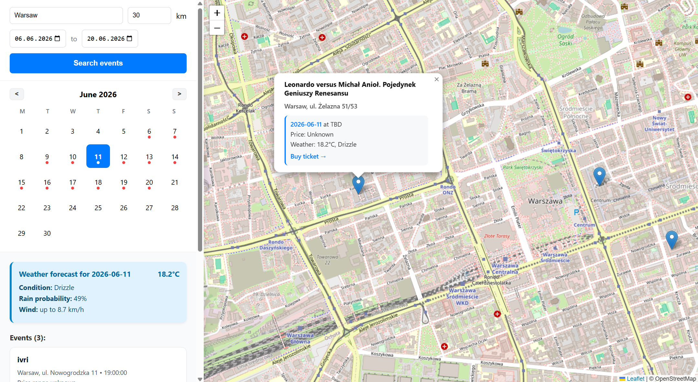

# Ticketmaster Weather Project

This project is a web application developed for the IT Systems Architecture course during the sixth semester (2025/2026) at the Warsaw University of Technology. 

It's a system whose main goal is to integrate information about upcoming cultural, sports, and entertainment events with precise weather forecasts for their specific locations. It solves a common problem for event attendees (especially for outdoor and travel events), allowing them to simultaneously search for entertainment and check weather conditions (up to 14 days in advance) without having to visit multiple different services. The results are presented on an interactive map integrated with a functional event calendar.

The full project documentation, along with the architectural justification, can be found in the `Dokumentacja.pdf` file. System architecture diagrams (created according to the C4 model standard) are located in the `diagrams/` folder.

# App UI

# Technologies Used
- **Backend:** Python, FastAPI, SQLAlchemy
- **Database:** PostgreSQL
- **Frontend:** HTML, JavaScript, CSS, Leaflet.js
- **API Integrations:** Ticketmaster API, Open-Meteo API
- **Infrastructure & Testing:** Docker, Docker Compose, Pytest, Apache JMeter

# Running the Project

Before running the application, ensure that there is a `.env` file in the root directory containing the appropriate API access keys (a template is available in the `.env.example` file).

The system supports three fully isolated containerized environments: development (`dev`), testing (`test`), and production (`prod`). In the commands below replace `{dev/test/prod}` with the chosen environment, e.g., `docker-compose.dev.yml`. The page is available under localhost:8080 for development and localhost:80 for production.

**Starting a selected environment:**

`docker compose -f docker-compose.{dev/test/prod}.yml up -d --build`

**Viewing real-time logs (debugging):**

`docker compose -f docker-compose.{dev/test/prod}.yml logs -f backend`

**Stopping the environment (and wiping the database volume):**

`docker compose -f docker-compose.{dev/test/prod}.yml down -v`

**Restarting only the backend server:**

`docker compose -f docker-compose.{dev/test/prod}.yml restart backend`

---
### Authors

- [Martyna Sadowska](https://github.com/Martyna-265)
- [Liliana Sirko](https://github.com/sirkoliliana)
